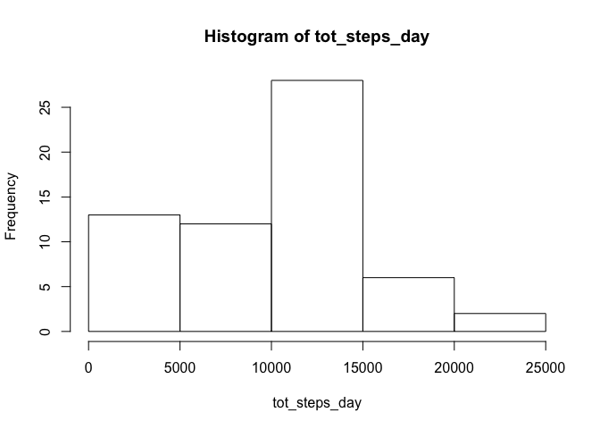
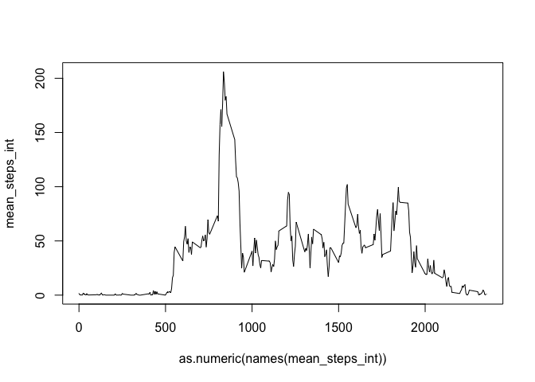
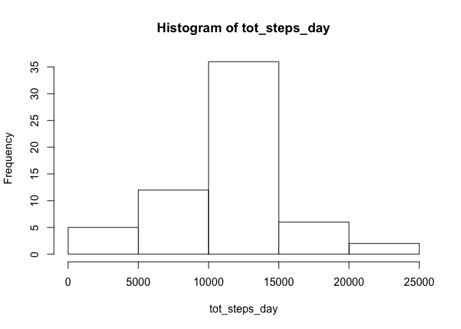
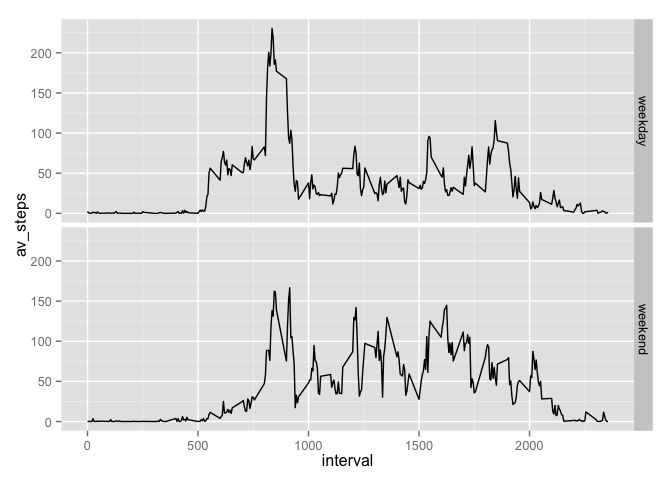

# Reproducible Research: Peer Assessment 1


##Loading and preprocessing the data


```r
setwd("/Users/magnusglindvad/Documents/Rprogramming/RepResearch")
activity = read.csv("RepData_PeerAssessment1/activity.csv")
```

##What is mean total number of steps taken per day?

1) Calculating total number of steps pr. day and plotting it in a histogram

```r
tot_steps_day = with(activity, tapply(steps, date, sum, na.rm = T))
hist(tot_steps_day)
```

 

2) Calcluting mean and median total number of steps pr. day

```r
mean = round(mean(tot_steps_day))
median = median(tot_steps_day)
```

- The mean total number of steps pr. day is: 9354
- The median total number of steps pr. day is: 10395

##What is the average daily activity pattern?

1)
Calculating and plotting mean steps pr. interval averaged over all days

```r
mean_steps_int = with(activity, tapply(steps, interval, mean, na.rm = T))
plot(x = as.numeric(names(mean_steps_int)), 
     y = mean_steps_int,
     type = "l")
```

 

2)
Calculating the interval with the maximum number of steps

```r
max_steps = max(mean_steps_int)
int_max_steps = names(which(mean_steps_int == max_steps))
to_print = paste0(int_max_steps, " - ", (as.numeric(int_max_steps) + 5))
```

- The 5 minute interval of the day that has the maximum average number of steps is: 835 - 840

##Imputing missing values

1) Calculating number of incomplete cases

```r
inc.cases = sum(!complete.cases(activity))
```

- The number of incomplete cases in the activity dataset is 2304

2) My strategy will be to fill NAs with the average of that interval from all other days as calculated in "What is the average daily activity pattern? - question 1"

3) Creating a function to calculate the missing values, and using it to return a column with the filled in missing values for the activity dataset

```r
act.fill.nas = function(x) {
        y = vector()
        for (i in seq_along(x))
                if(is.na(x[i])) {
                      int.val = as.character(activity[,"interval"][i])
                      index = which(names(mean_steps_int) == int.val)
                      y[i] = mean_steps_int[index]
                } else {
                        y[i] = x[i]
                }
        x = y
        x
}
activity$steps = act.fill.nas(activity$steps)
head(activity)
```

```
##       steps       date interval
## 1 1.7169811 2012-10-01        0
## 2 0.3396226 2012-10-01        5
## 3 0.1320755 2012-10-01       10
## 4 0.1509434 2012-10-01       15
## 5 0.0754717 2012-10-01       20
## 6 2.0943396 2012-10-01       25
```

4) 

```r
tot_steps_day = with(activity, tapply(steps, date, sum, na.rm = T))
hist(tot_steps_day)
```

 

```r
mean = format(round(mean(tot_steps_day)), scientific = F)
median = format(round(median(tot_steps_day)), scientific = F)
```

- Now the mean total number of steps pr. day is: 10766
- And the median total number of steps pr. day is: 10766
- The Values differ, the median is very close, to the same, but the mean value, changed a lot. In this setting when calculating total steps and ignoring NAs all NAs will be counted as zero. so the results will be biased towards zero total steps pr. day.

##Are there differences in activity patterns between weekdays and weekends?
1)

```r
require(dplyr)
```

```
## Loading required package: dplyr
## 
## Attaching package: 'dplyr'
## 
## The following objects are masked from 'package:stats':
## 
##     filter, lag
## 
## The following objects are masked from 'package:base':
## 
##     intersect, setdiff, setequal, union
```

```r
activity = mutate(activity,
                  date = as.Date(date, format = "%Y-%m-%d"),
                  daytype = ifelse(weekdays(date) %in% c("Lørdag", "Søndag"), "weekend", "weekday")) %>%
        group_by(daytype, interval) %>%
        summarise(av_steps = mean(steps))
```

2)

```r
require(ggplot2)
```

```
## Loading required package: ggplot2
```

```r
ggplot(activity, aes(x = interval, y = av_steps)) +
        geom_line() + 
        facet_grid(daytype ~ .)
```

 

